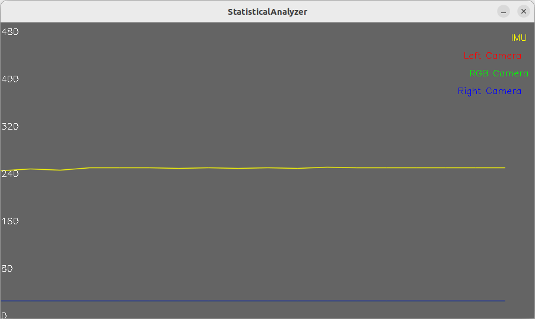

# SyncTrigger

SyncTrigger is a header-only template library that supports all types of sensors, provided that the data packages are defined according to the specified requirements..

---




## Quick Start

```bash
mkdir build && cd build

cmake ..

make -j$(nproc)

sudo make install
# test(optional)https://github.com/hudson-trading/corral.git
ctest

```

## Key Features

* **🎯 Trigger-Driven Alignment**: The synchronization check is strictly driven by a primary sensor.
    *(Recommended practice: Use the sensor with the lowest frequency as the trigger to minimize redundant processing).*

* **🛠 Universal Compatibility**: Supports an arbitrary number of sensors and diverse data types through C++20 variadic templates, ensuring flexibility for complex multi-modal systems.

* **🚀 Efficient Event Notification**: Leverages Linux-native `poll` and `eventfd` mechanisms for non-blocking, low-latency event notification, eliminating CPU-heavy busy-waiting.

* **📊 Statistics**: Provides comprehensive statistics on synchronization performance, including sensor data arrival jitter at the host.

## Future Roadmap

* **🛡️ Enhanced Robustness**: Improve system resilience against real-world challenges, such as handling significant data jitter (arrival timing variance) and implementing automatic recovery for sensor disconnection.

* **📊 Performance Statistics**: Support detailed telemetry and diagnostic output, including real-time tracking of key metrics such as packet loss rate, synchronization latency, and buffer pressure.
